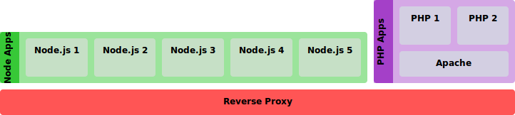

stackgram
=========

Create HTML stack diagrams with JavaScript. Works with Browserify.

*This project is an experient and not production code.*



## Example

````javascript
var sg = require('stackgram'),
	el = document.querySelector('#stack'),
	options = sg.createOptions(),
	i;

var proxy = sg.component('Reverse Proxy').size(1).color(255, 85, 85);
options.add(proxy);

var nodeGroup = sg.group('Node Apps').color(55, 200, 55);
proxy.add(nodeGroup);

for (i = 0; i < 5; i++) {
	nodeGroup.add(sg.component('Node.js ' + (i + 1)).size(2).color(198, 224, 198));
}

var phpGroup = sg.group('PHP Apps').color(164, 64, 200);
proxy.add(phpGroup);

var apache = sg.component('Apache').size(1).color(211, 207, 226);
phpGroup.add(apache);

for (i = 0; i < 2; i++) {
	apache.add(sg.component('PHP ' + (i + 1)).size(2).color(211, 207, 226));
}

sg.create(el, options);
````
